# Report

#### Greedy
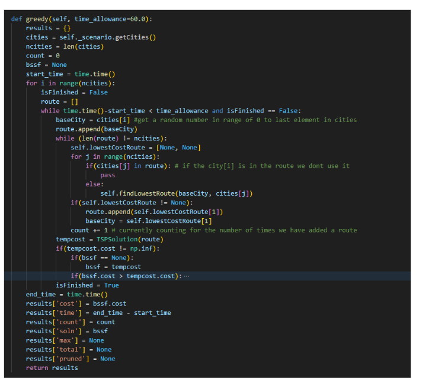
#### Branch and Bound
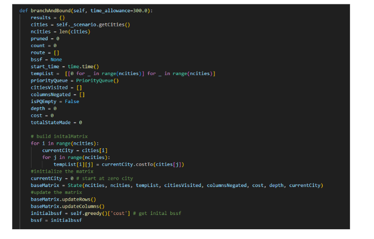
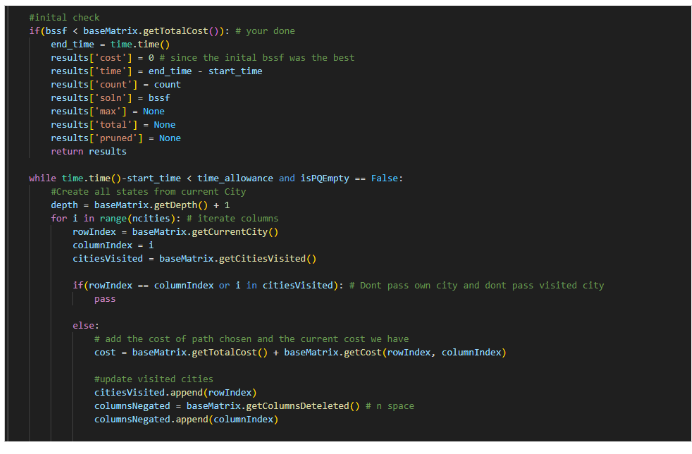
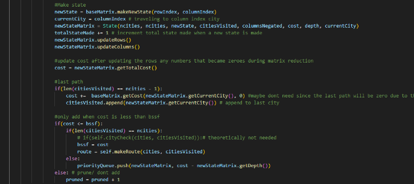
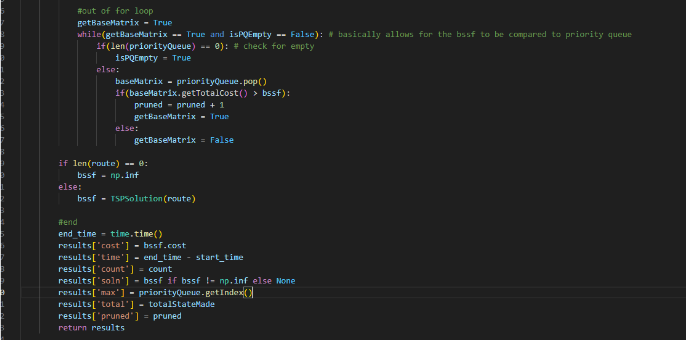
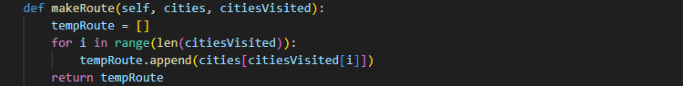

#### States Class

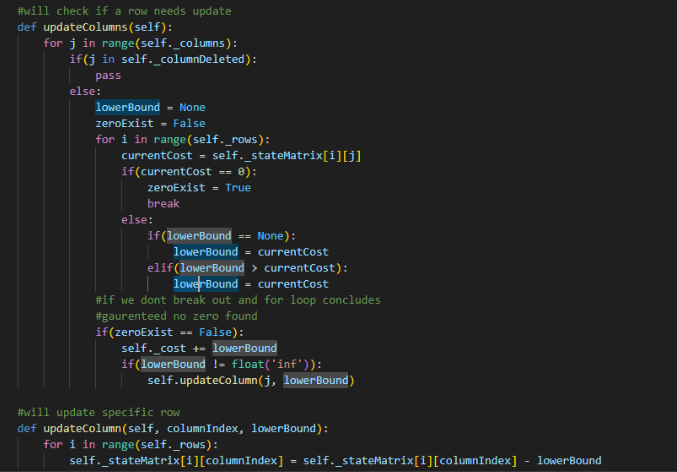
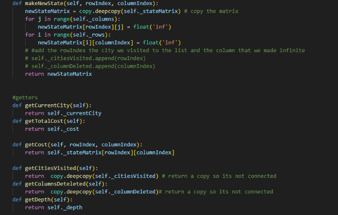

#### Priority Queue
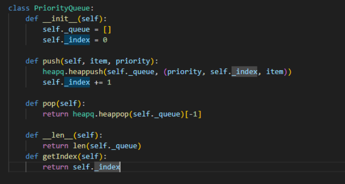

---

### Time and Space Complexity Discussion

#### Greedy Algorithm
- **Time Complexity:** O(n³)
- **Space Complexity:** O(n)

The time complexity is O(n³) due to the nested loops: one `while(len != ncities)` and two nested `for` loops. The first loop takes O(n), and inside it, the nested loops operate at O(n²), leading to a combined time complexity of O(n³).  
The space complexity is O(n), as the `route` list stores the shortest path that goes through all cities.
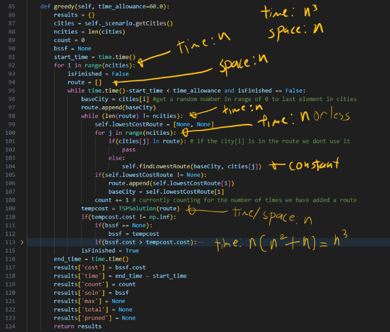
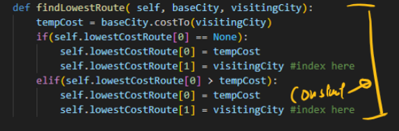
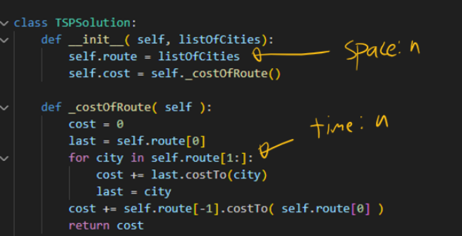
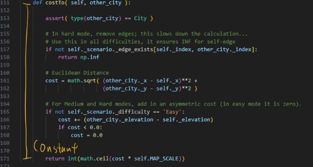

#### Priority Queue
- **Time Complexity:** O(log n)
- **Space Complexity:** O(1)

The priority queue uses the `heapq` library. Push and pop operations are O(log n), as per its documentation, while space complexity is constant since no significant space is created.
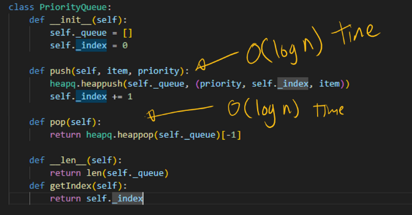

#### Reduced Cost Matrix (Including Updating)
- **Time Complexity:** O(n²)
- **Space Complexity:** O(1)

Both row and column updates have a time complexity of O(n²) due to the two nested loops, each iterating over n elements. Space complexity is constant as no additional space is created.
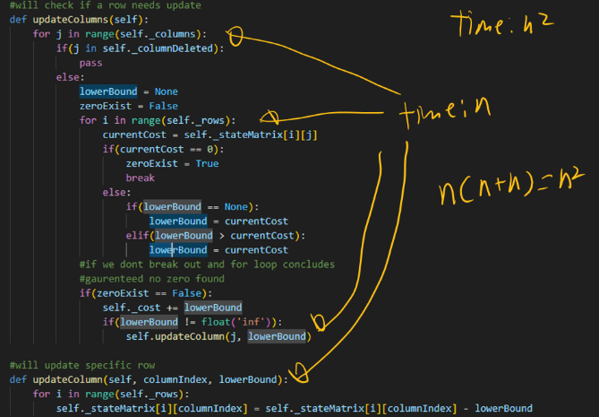
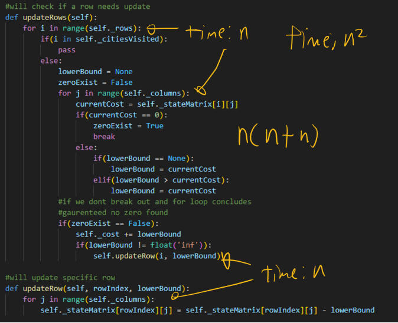

#### BSSF Initialization
- **Time Complexity:** O(n³)
- **Space Complexity:** O(n)

The initial BSSF (Bounded Suboptimal Solution First) is generated using the greedy algorithm, which has O(n³) time complexity and O(n) space complexity, as mentioned earlier.

#### Expanding One Search State into Its Children
- **Time Complexity:** O(n³) (worst case)
- **Space Complexity:** O(n²)

The expansion time complexity is O(n³), driven by the nested loops and the reduced cost matrix updates. The space complexity is O(n²), as the worst case requires storing n² elements.
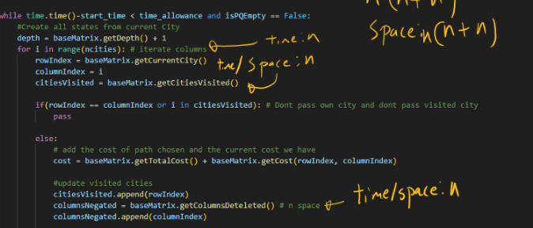
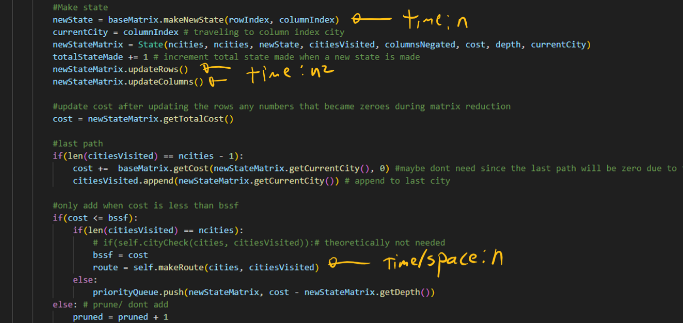
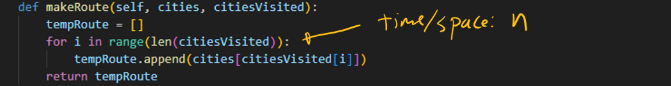

#### Full Branch and Bound Algorithm
- **Time Complexity:** O(n³ * time)
- **Space Complexity:** O(n² * time)

The time complexity is O(n³) multiplied by the time required for the loop to run, as the algorithm involves expanding matrices and creating child states. Space complexity is O(n²) for storing the expanded matrices, and it also scales with time due to the loop.

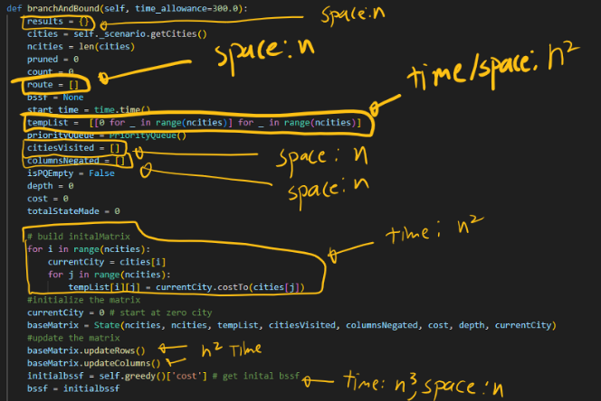
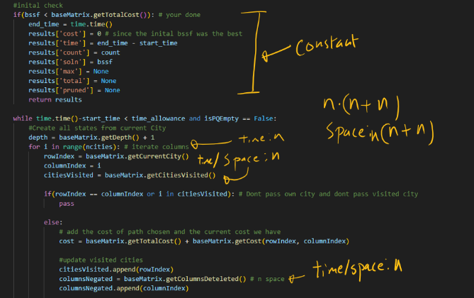
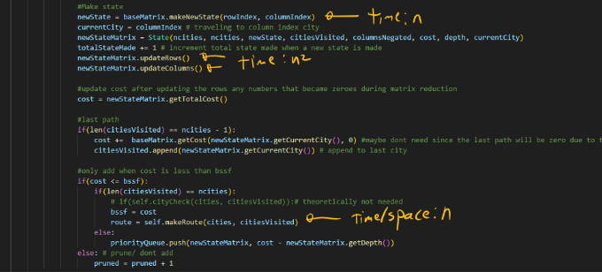
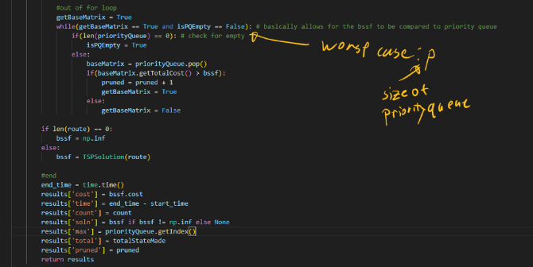
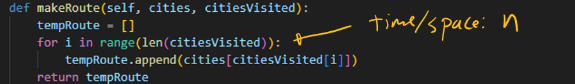
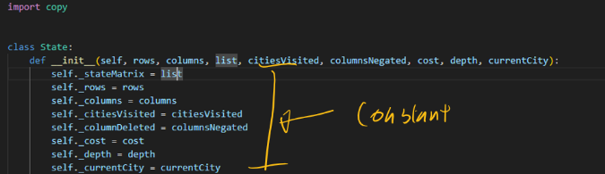
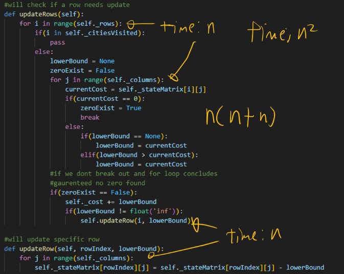
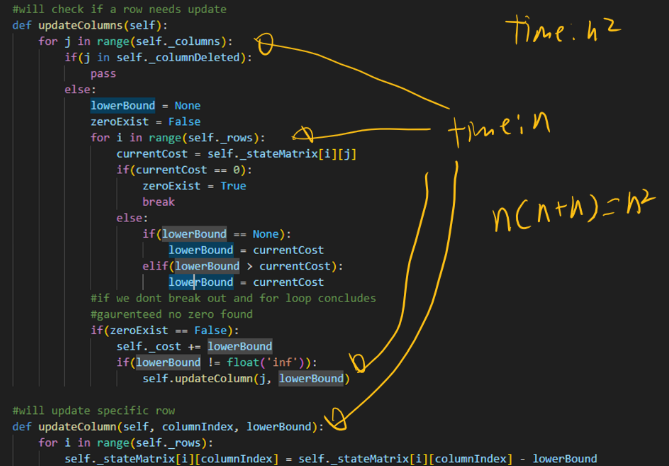
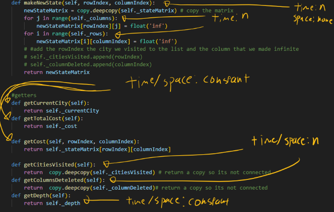
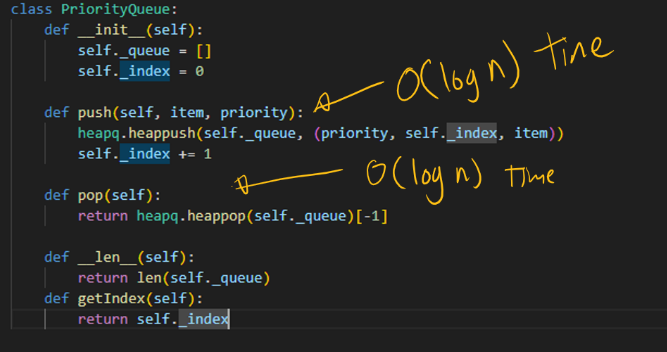

---

#### Data Structures for States
The states are represented using a double array that mimics a matrix, where `[from city][to city]` holds the cost to travel between those cities.

---

#### Priority Queue Data Structure
I used the `heapq` library for the priority queue. It operates by pushing items onto the queue along with their priority. The item with the smallest priority is popped first. The queue is updated to always maintain the
